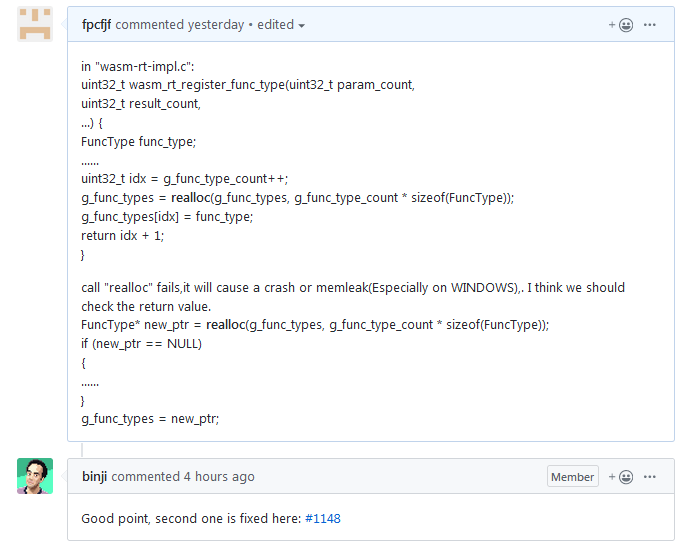

# wabt的一个隐性内存问题

# 一、WABT项目
WABT项目是Webassembly的一个基础的软件集，在许多项目中都被引用到，诸如以太坊的下一代虚拟机Hera，EOS的虚拟机等。它提供了一整套的Webassembly的相关工具，支持Wasm的各种文件之间便捷快速的相互转换。其项目地址在：
</br>
https://github.com/WebAssembly/wabt

# 二、WABT的问题
这次发现的内存问题在wasm2c这个项目中，位于文件wasm-rt-impl.c中，函数wasm_rt_register_func_type中使用了realloc这个内存分配函数，看一下代码：
</br>

```C++
uint32_t wasm_rt_register_func_type(uint32_t param_count,
                                    uint32_t result_count,
                                    ...) {
  FuncType func_type;
......

  uint32_t idx = g_func_type_count++;
  //主要是下面这个重新分配内存的动作
  g_func_types = realloc(g_func_types, g_func_type_count * sizeof(FuncType));
  g_func_types[idx] = func_type;
  return idx + 1;
}
```
这里涉及到了realloc的经典应用问题两个中的一个，这两个经典的应用问题如下：
</br>

## 1、分配失败的检测问题
先看代码：
</br>

```C++
void *p = realloc(p,size);
if (!p)
{
  //处理并返回错误
  ......
  return err;
}
```
</br>
这里本身就有一个问题，即当realloc调用失败时，此时返回一个NULL指针，那么，p就会被污染，导致原有的内存区泄露。另外，如果此处分配失败，在后面使用分配的内存没有判断时，一个Crash应该是不可避免的。那么正确的用法应该是什么样子呢？
</br>

```C++
void *pTmp = realloc(p,size);
if (!pTmp)
{
  //处理并返回错误
  ......
  return err;
}

p = pTmp;
```
</br>
可能代码看上去不如上面的优雅，但是却安全了。
## 2、0内存分配使用的问题
在C语言中，使用malloc(0)是正确的，而且可以用free却释放返回的指针，不会有任何问题。但是看一下realloc这个函数使用0做分配参数时，会是什么结果呢？
“Otherwise, if size is zero, the memory previously allocated at ptr is deallocated as if a call to free was made, and a null pointer is returned.（c/c++98）
</br>
If size is zero, the return value depends on the particular library implementation: it may either be a null pointer or some other location that shall not be dereferenced.（c/c++11）”
</br>
其实就是在早期版本0意味着和free相同，后来的新版本，就得看具体环境的实现了。其实后者更可怕，未知的东西有可能就是在东家好，在西家就用不了。还不如直接报错呢。看一下代码：
</br>

```C++
void *pTmp = realloc(p,0);
free(pTmp)
```
这等于是重复释放内存，直接就会崩溃。
</br>
从上面可以看到，这里的问题，其实就是第一个分配失败的检测问题，但是第二个希望也引起重视。

# 三、修复
这个BUG目前已经提交到了GITHUB，并生成了一个新的修改分支“wasm2c-realloc”,截图如下：
</br>



</br>
修复可能会持续一小段时间。

# 四、总结
通过上述分析可以看出，在c++中对内存的控制管理比在纯c中要复杂的多，但正因为C简单，才会让好多人大意，如果把相关的内存分配函数分析明白，其实这个问题是不应该出现的。
